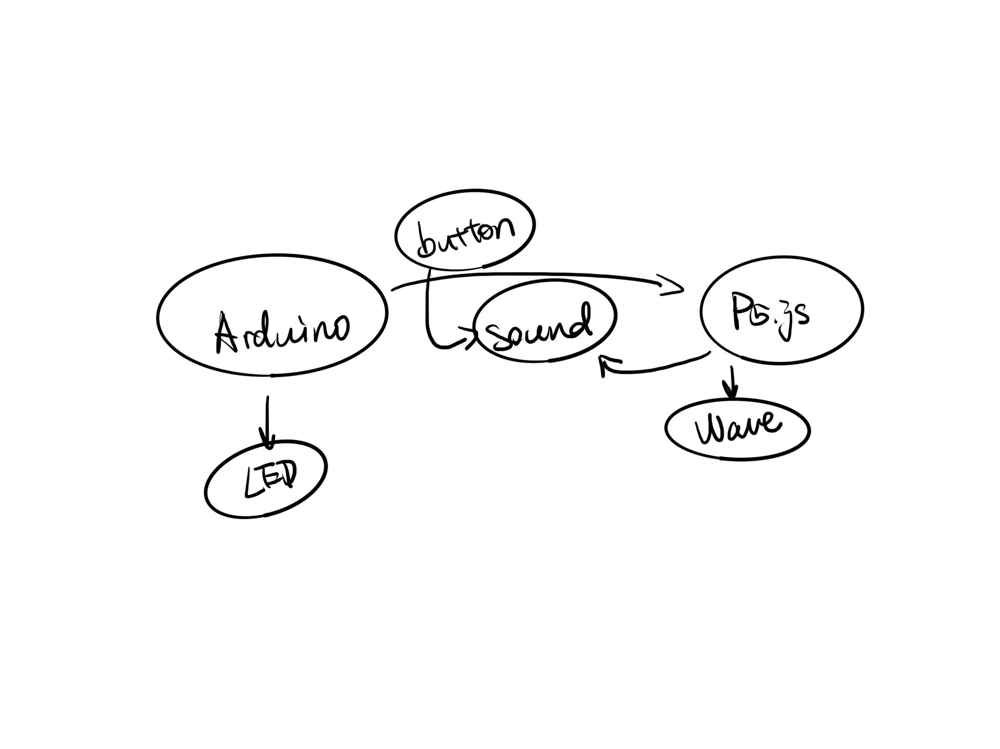

# HWFinalProject
## Milestone 1
Instrument

This instrument can be played using seven buttons, each representing a different musical note. When a note is played, a corresponding indicator light will illuminate. Simultaneously, seven graphics on the screen represent the seven notes. Depending on the button pressed, a clicking animation will appear in the row corresponding to the pressed note, accompanied by ripple-like waves at the bottom of the screen, resembling sound waves. Additionally, users can also play the instrument by clicking on the graphics displayed on the screen.

Shadow Hands

Using the computer's camera to recognize our hands, this interactive game displays random images on the screen. Players must replicate the shapes shown by making corresponding hand gestures. During this process, various shapes will fall from the top of the screen, and players need to press the corresponding buttons when these shapes reach a baseline at the bottom. Only by successfully completing the gesture can players proceed to the next challenge. (Suitable for two players)

Text-based Game

In this game, only text appears on the screen, specifying tasks for the player, such as turning on a red light bulb or finding all the letter "O"s. Subsequently, players need to complete these tasks by performing actions like moving, clicking, or dragging on the screen or breadboard. Throughout the process, there may be some simple dialogues, like "Why not try moving something?" or "Can't find it, huh? Hahaha," adding a playful element to the game.

## Milestone 2
**Idea**

**FSM diagram**

**Circuit diagram**

In HW12, I have debugged and tested the basic coding for connecting buttons with the visual elements in P5.js. This part works well, and I just need to replicate it for seven different colors and positions. However, I need to figure out how to arrange seven LED lights orderly on the breadboard, considering the limited space and available digital pins. I must pay attention to the circuit connections.

For the musical aspect, after researching, I found a relevant library on the Arduino website called the "Tone Arduino library." The website also provides coding-related content that I can incorporate into the files for future testing. Additionally, I plan to use P5.play for interactive elements on the screen. I intend to create a piano effect by sliding a string to generate different pitches. I will also use a potentiometer to change the values and alter the presentation of visual elements on the screen (color, shape, or position).

One idea: I'm considering is whether I can use the potentiometer to change the pitch of each note, creating a sharp or flat effect.

User testing plan:
1. Ensure that the buttons work correctly. When a button is pressed, the corresponding visual effect and sound should appear on the screen.
2. Test the interactive elements on the screen. Sliding the string should interact properly.
3. Experiment with changing elements on the screen by adjusting the potentiometer values (color, shape, or position).

Regarding the integration of these functionalities, the challenge lies in combining two programs and devices with slight language differences. I encountered difficulties when the languages on both sides couldn't be recognized. Integrating multiple features may introduce various limitations and potential errors in code writing and expression. With the inclusion of buttons, potentiometers, and LEDs, we are dealing with readings from two different sources, resembling a more complex combination lock.

I have always believed that the fusion of music and visuals offers a deeply engaging and delightful experience. I aim to experiment with different visual effects and explore the fascinating world of illuminated displays. I hope to successfully showcase my favorite features – lights, interaction, visuals, and music – in this assignment.

## Milestone 3
**System diagram**

This week, I've almost resolved all coding issues between Arduino and p5.js. Following discussions with the professor, I transitioned from the initial effects of two buttons to achieving a complete effect with seven buttons.

Here are the coding issues I encountered last week:

1, the problem that the button effect is not displayed after two buttons
2, the page is not displayed in the problem
3, button input is empty problem
4, the problem that the wave is not continuous
5, How to show the effect of water wave in wave.
6, Audio problem (sound library in P5js is used here to make the sound more like music)
These are the problems about coding that I met last week

In addition, I successfully tackled circuit connection issues on the Arduino breadboard. Due to the need for seven buttons to be connected in parallel, each with an individual LED in series, the wiring on the breadboard became complex. This complexity increased the likelihood of misconnections or errors. Initially, doubts arose about whether the lack of a complete wave display on the screen was due to poor contact or faulty components on the breadboard. However, after connecting the LEDs and observing their illumination and extinguishing, I confirmed the integrity of the components.

With guidance from the professor, I streamlined the code, reducing it from several hundred lines to just a few dozen. This not only enhanced readability but also clarified the logic of the code.

After completing the Arduino-related code this week, my focus for the upcoming week will be on adjusting and adding visual elements for p5.js display on the screen. This involves:

1, make the part of the wave display look more like a stage (or a digital style interface)
2, Complete another part of the vertical line in the idea. And add animation for on-screen interaction
3, The style of the animation should be the same as the overall effect. Make the whole project more interactive and playable.

# FINAL Milestone !!!!!!
## Idea

## System diagram

## FSM diagram

## Circuit diagram

**”Description of any external data or library that you are planning to use“**

- p5.webserial
- p5.sound

**”Description of any sensor, output component or mechanism that you are planning on using or building“**

First and foremost, the project can be divided into three main parts: p5.js, Arduino, and the integration of both elements.

In the p5.js segment, I've implemented text and line effects displayed on the screen.  For the Arduino part, I've utilized an Arduino board, wires, resistors, seven LEDs, and seven buttons, crucial components that contribute to the core functionality of the project.  Successful interaction is achieved when these components work in conjunction with the p5.js code.

In the collaborative section, based on my concept, users can play an instrument using the seven buttons.  Pressing a button triggers a unique sound, simultaneously lighting up the corresponding LED and initiating a wave effect on the screen.  Multiple buttons can be pressed simultaneously.  Releasing the buttons causes the wave effect to gradually fade away.

**”Short discussion of why your project is relevant“**
1. how is it related to our readings?

2. how does it connected to society?
3. why is it important to you?

