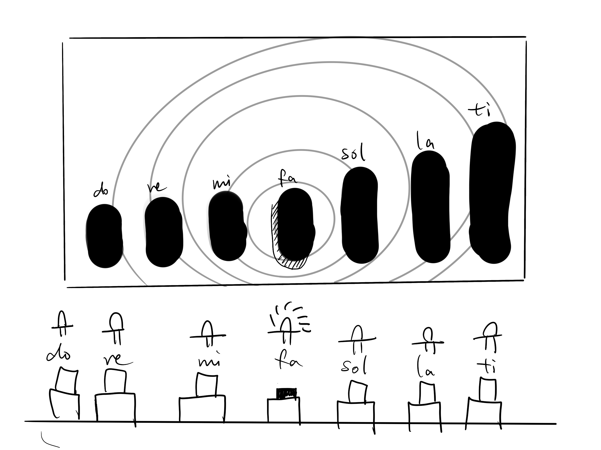
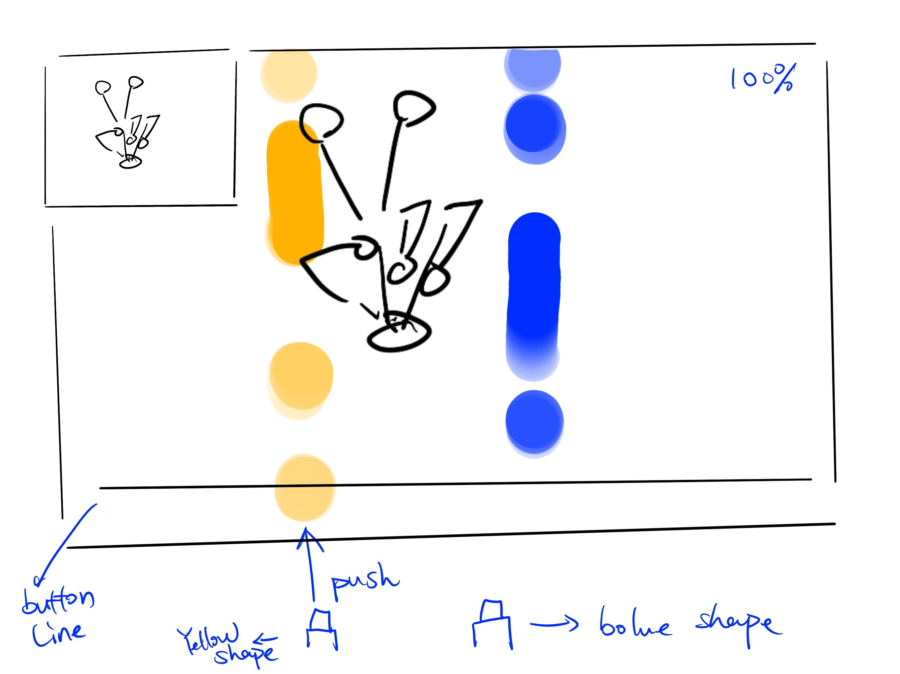
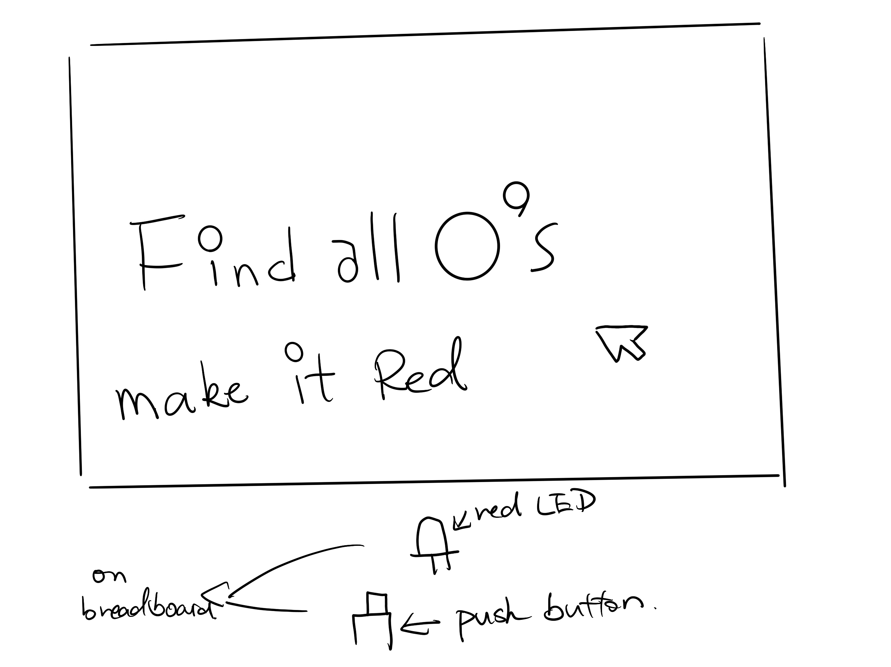
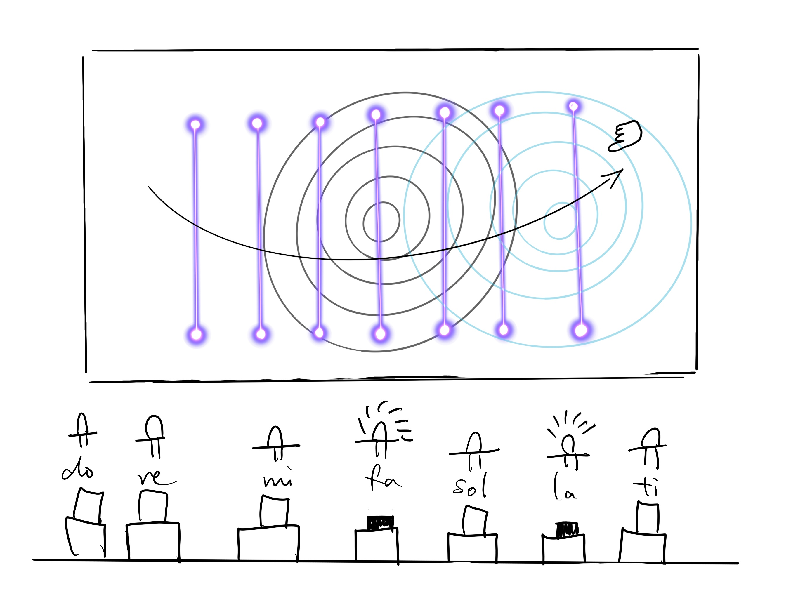
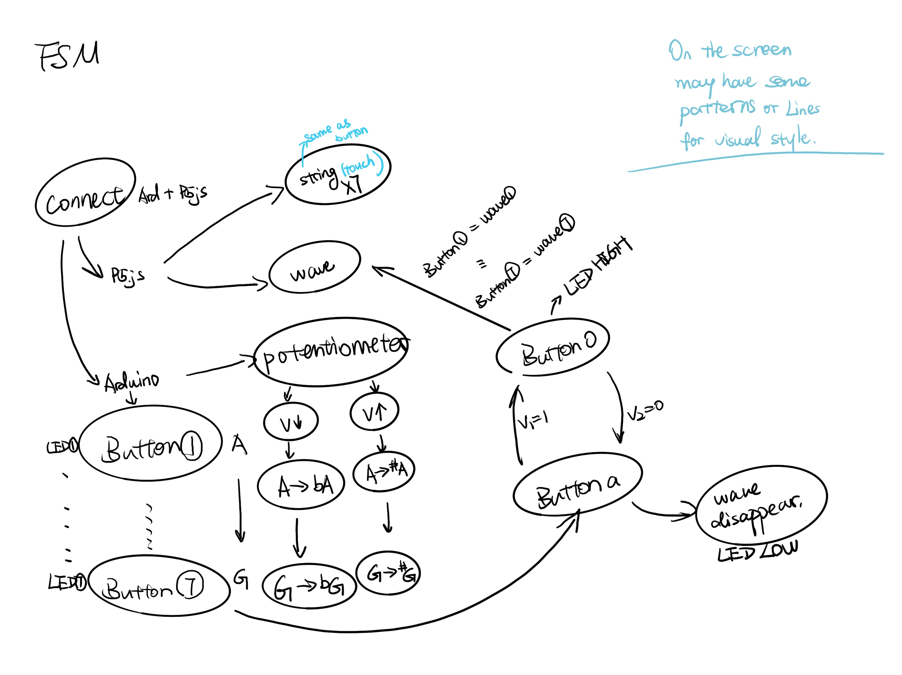
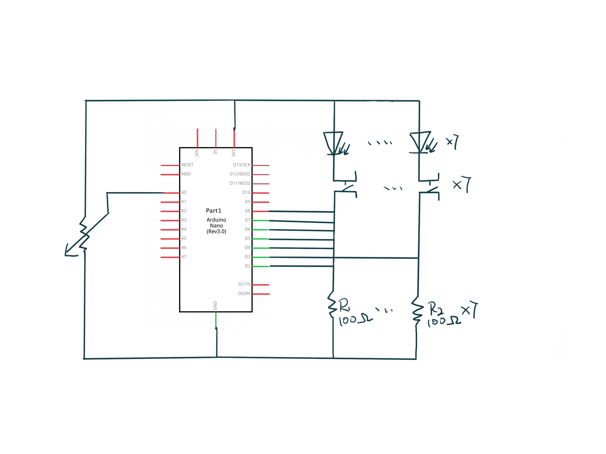

# HWFinalProject
## Milestone 1
Instrument

This instrument can be played using seven buttons, each representing a different musical note. When a note is played, a corresponding indicator light will illuminate. Simultaneously, seven graphics on the screen represent the seven notes. Depending on the button pressed, a clicking animation will appear in the row corresponding to the pressed note, accompanied by ripple-like waves at the bottom of the screen, resembling sound waves. Additionally, users can also play the instrument by clicking on the graphics displayed on the screen.

Shadow Hands

Using the computer's camera to recognize our hands, this interactive game displays random images on the screen. Players must replicate the shapes shown by making corresponding hand gestures. During this process, various shapes will fall from the top of the screen, and players need to press the corresponding buttons when these shapes reach a baseline at the bottom. Only by successfully completing the gesture can players proceed to the next challenge. (Suitable for two players)

Text-based Game

In this game, only text appears on the screen, specifying tasks for the player, such as turning on a red light bulb or finding all the letter "O"s. Subsequently, players need to complete these tasks by performing actions like moving, clicking, or dragging on the screen or breadboard. Throughout the process, there may be some simple dialogues, like "Why not try moving something?" or "Can't find it, huh? Hahaha," adding a playful element to the game.

## Milestone 2
**System diagram**

**FSM diagram**

**Circuit diagram**

In HW12, I have debugged and tested the basic coding for connecting buttons with the visual elements in P5.js. This part works well, and I just need to replicate it for seven different colors and positions. However, I need to figure out how to arrange seven LED lights orderly on the breadboard, considering the limited space and available digital pins. I must pay attention to the circuit connections.

For the musical aspect, after researching, I found a relevant library on the Arduino website called the "Tone Arduino library." The website also provides coding-related content that I can incorporate into the files for future testing. Additionally, I plan to use P5.play for interactive elements on the screen. I intend to create a piano effect by sliding a string to generate different pitches. I will also use a potentiometer to change the values and alter the presentation of visual elements on the screen (color, shape, or position).

One idea: I'm considering is whether I can use the potentiometer to change the pitch of each note, creating a sharp or flat effect.

User testing plan:
1. Ensure that the buttons work correctly. When a button is pressed, the corresponding visual effect and sound should appear on the screen.
2. Test the interactive elements on the screen. Sliding the string should interact properly.
3. Experiment with changing elements on the screen by adjusting the potentiometer values (color, shape, or position).

Regarding the integration of these functionalities, the challenge lies in combining two programs and devices with slight language differences. I encountered difficulties when the languages on both sides couldn't be recognized. Integrating multiple features may introduce various limitations and potential errors in code writing and expression. With the inclusion of buttons, potentiometers, and LEDs, we are dealing with readings from two different sources, resembling a more complex combination lock.

I have always believed that the fusion of music and visuals offers a deeply engaging and delightful experience. I aim to experiment with different visual effects and explore the fascinating world of illuminated displays. I hope to successfully showcase my favorite features – lights, interaction, visuals, and music – in this assignment.